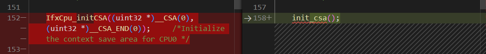
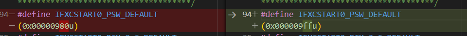

### 简介

这是一篇记录学习Tricore CSA的笔记，有没有后续不确定

### AP32386_AURIX_Context_Handling_v10.pdf文档的一些内容摘录

#### 什么是上下文?

在RTOS中通过软件进行任务调度时需要进行上下文切换，在aurix中上下文包含了通用数据和地址寄存器，PC指针，编程状态信息(PCXI PSW).

还有一种情况是中断\trap\函数调用时发生上下文切换。

#### upper context和lower context


每个context有16个word的数据，其中存储的内容是不同的。

这两种CSA的应用途径不同。

upper context主要存储的是通过硬件触发的上下文切换的内容，例如(中断\TRAP\函数调用)

lower context保存需要通过软件的指令，例如SVLCX指令，恢复可以通过RSLCX.

#### CSA中连接地址的数据结构

CSA连接标的地址的表示的结构如下图所示


应用实例如下图所示


7<<12位=0x7000

0x6F0<<6=0x1BC00

拼接在一起得到0x7001BC00的地址。


#### FCX\PCX\LCX

- FCX:第一个可用的CSA地址
- LCX:最后一个可用的CSA地址
- PCX:上一个CSA地址

如果FCX等于LCX的话，CSA耗尽，触发TRAP中断


#### 关于ILLD中CSA初始化函数的分析

**清空PCXI**


**CSA FCX LCX的初始化**


#### 关于进入TRAP之前的32字节对齐的要求

```
__asm(" .align 5");
```

上述语句在HIGHTEC编译器中的意思是对齐2^5=32字节。

这让我想到了之前移植mcal demo工程中的Traps.c函数不起作用。

```
  /* ; Class 0, MMU Traps: */
  __asm (".align 8");
  __asm("j       _trap_0"); /*        ; Jump to the trap handler */
```

而将上述的代码改成

```
  __asm(".align 5");
  __asm("j       _trap_0"); /*        ; Jump to the trap handler */
```

就可以正常工作

### 一些测试代码块的记录

#### 关于未初始化CSA之前调用函数

会触发contextmanageterror函数，并进入_debug()状态卡死


初始化csa调用函数的示例代码

将初始化函数直接封装成函数



在初始化csa之前不能调用函数，但是有inline标志的函数是没有问题的。

#### 初始化CSA区域后的内存

UDE调试结果

```
0x7000fc00 0x7000fc00     0 g __CSA0                              dsram0 .CPU0.csa        .CPU0.csa                                   2_Out/TC264/MAIN/TC264.elf
0x70011c00 0x70011c00     0 g __CSA0_END                          dsram0 .CPU0.csa        .CPU0.csa                                   2_Out/TC264/MAIN/TC264.elf
```

0x7000fc00为csa0的起始位置

0x70011c00为csa0的结束位置


通过上图可以观察到定义为CSA初始化的每一块区域的开头都存放了指向下一个位置的地址信息。


可以发现LCX记录的是0x70011B40的地址，不是倒数第三个CSA的地址，而是倒数第二个的地址，但是不清楚为什么CSA的最后的一块指向会预留两块区域。

#### 递归调用函数增加PSW.CDC的计数值


上述图片展示了PSW.CDC的寄存器可以检查堆栈的深度。

#### 递归的测试代码如下

```
uint32 num;
void recursiveTest(void)
{
    for (uint32 i = 0; i < 1000; i++)
    {
        for (uint32 j = 0; j < 1000; j++)
        {
        }
    }
    num++;
    recursiveTest();
}
```


### 网络上一些关于CSA的博客和文章

#### 函数在CSA空间足够的情况下是否能一直递归调用下去?

还有个PSW.CDC的寄存器指示递归深度。

https://www.jianshu.com/p/90b698a1b28a


上述图片是如果第7位为0，这就是个6位溢出计时器，（默认)

如果第7位为1，第6位为0，这就是个5位计数值

以此类推，

因此，如果递归深度大于等于64就会报trap故障


通过修改PSW CDC的参数，可以关闭递归跟踪，直到CSA用尽才进入trap

